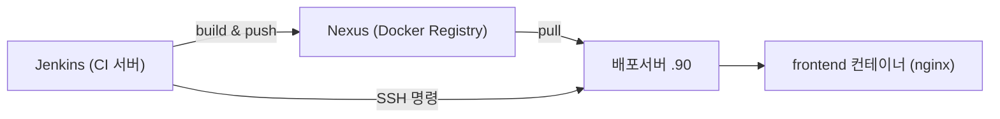

> 📅 **학습일**: 2026-06-26

> 💡 **한 줄 요약** — Jenkins가 Docker로 이미지를 빌드해 사내 Nexus 레지스트리에 push하고, 배포 서버엔 SSH로 들어가 그 이미지를 pull해 `docker compose`로 재기동하는 **이미지 레지스트리 경유(pull-based) 배포** 패턴. 프론트의 백미는 **런타임 config.js 주입**으로 한 번 빌드한 이미지를 모든 환경에 재사용하는 부분.


## 0. 이 파이프라인의 "유형"부터


CI/CD 패턴은 크게 두 갈래다.


| 패턴                        | 방식                                                  | 예시              |
| ------------------------- | --------------------------------------------------- | --------------- |
| **Push 배포**               | CI 서버가 산출물(jar, dist)을 대상 서버로 직접 복사 후 실행            | 전통적 `scp + 재시작` |
| **이미지 레지스트리 경유 (이 프로젝트)** | CI가 Docker 이미지를 만들어 레지스트리에 올리고, 대상 서버는 그걸 pull해서 실행 | 이 Jenkinsfile   |


이 패턴의 장점이 곧 설계 의도다.

- **재현성**: 빌드 환경(Node 버전 등)이 이미지에 박제 → "내 PC에선 됐는데" 제거
- **롤백 용이**: 이전 이미지 태그만 다시 띄우면 끝
- **폐쇄망 대응**: 인터넷 안 되는 고객사도 사내 레지스트리(Nexus)만 있으면 됨

## 1. 등장인물 (구성요소와 역할)





| 구성요소                   | 역할                | 이 프로젝트의 선택                   |
| ---------------------- | ----------------- | ---------------------------- |
| **Jenkins**            | 빌드 오케스트레이터(지휘자)   | 직접 빌드 안 함, Docker에게 시킴       |
| **Nexus**              | 사설 Docker 이미지 저장소 | 폐쇄망이라 Docker Hub 대신 사내 Nexus |
| **배포서버**               | 실제 컨테이너 구동        | `docker compose`로 운영         |
| **Dockerfile**         | "빌드 레시피"          | 멀티스테이지                       |
| **docker-compose.yml** | "운영 레시피"          | 서비스 5개 + 의존성                 |


> ⭐ 가장 중요한 개념: **Jenkins는 빌드를 직접 안 한다.** Node/JDK도 불필요. 모든 빌드를 `docker build`에 위임 → Jenkins 서버 관리가 가벼워진다.


## 2. 핵심 개념 ① — Docker 멀티스테이지 빌드


`frontend/Dockerfile` — 빌드 도구는 1단계에서 버리고, 정적 파일 + nginx만 최종 이미지에 남긴다.


```docker
# ===== Stage 1: builder =====
FROM node:22-alpine AS builder
WORKDIR /app
COPY package*.json ./
RUN npm ci
COPY . .
RUN npm run build           # tsc -b && vite build → /app/dist

# ===== Stage 2: runtime =====
FROM nginx:1.27-alpine
COPY --from=builder /app/dist /usr/share/nginx/html   # 결과물만 가져옴
COPY nginx.conf /etc/nginx/conf.d/default.conf
COPY docker-entrypoint.sh /docker-entrypoint.sh
ENTRYPOINT ["/docker-entrypoint.sh"]
```


**왜 두 단계?** 한 단계면 최종 이미지에 Node·node_modules(수백 MB)·소스가 다 들어간다 → 무겁고 소스 노출. 멀티스테이지는 이미지를 수십 MB로 줄이고 공격 표면도 축소. _프론트(SPA)뿐 아니라 백엔드(jar)도 동일 패턴이 표준._


## 3. 핵심 개념 ② — Build-time vs Runtime 환경 분리 ⭐


SPA 배포에서 가장 흔히 틀리는 부분. **"API 주소 같은 환경값을 빌드 시점에 박을까, 실행 시점에 주입할까?"** → 이 프로젝트는 **런타임 주입** 선택.


```bash
# docker-entrypoint.sh — 컨테이너 시작 시 실행
#!/bin/sh
cat <<EOF > /usr/share/nginx/html/config.js
window.__APP_CONFIG__ = { API_BASE_URL: "${API_BASE_URL:-}" };
EOF
exec nginx -g 'daemon off;'
```


**왜 중요한가?**

- Vite의 `import.meta.env.VITE_*`는 **빌드 시점에 코드에 박힌다** → 환경(dev/staging/prod)마다 재빌드 필요.
- `config.js`를 부팅 시 생성하면 **한 번 빌드한 이미지를 모든 환경에 그대로** 쓰고, 환경변수(`API_BASE_URL`)만 바꿔 주입한다. "Build once, deploy anywhere".
- staging에서 검증된 **동일 바이트**가 그대로 prod로 간다.

> 📌 **이식 포인트**: `index.html`에서 `<script src="/config.js">`를 앱 번들보다 먼저 로드하고, 코드에서 `window.__APP_CONFIG__`를 읽으면 그대로 복사 가능한 트릭.


## 4. 핵심 개념 ③ — 태그 전략 (배포 = 태그 게임)


```plain text
빌드 전:  Nexus의 main-latest  →  pull 후 main-prev 로 retag/push  (백업)
빌드 후:  새 이미지            →  main-latest 로 push              (현재)
```

- `<브랜치>-latest` = "지금 배포 중인 것"
- `<브랜치>-prev` = "직전 것 = 롤백 대상"

**왜 latest 하나만 안 쓰나?** 새 배포가 망가졌을 때 되돌릴 이전 이미지가 필요 → 새 걸 올리기 _전에_ 기존 latest를 prev로 백업(Stage 4 Preserve prev). 실무에선 추가로 `git-commit-hash`·`빌드번호` 태그를 붙여 영구 추적하는 경우가 많다.


## 5. 핵심 개념 ④ — "배포"는 결국 SSH로 원격 명령


Jenkins가 대상 서버에 실제로 하는 일은 단순하다.


```bash
# 1. (SCP) compose 파일 + .env 복사
scp docker-compose.yml  user@<ip주소>:/opt/sns-프로젝트S/
scp .env.example        user@<ip주소>:/opt/sns-프로젝트S/

# 2~3. (SSH) pull → up
ssh user@<ip주소> 'cd /opt/sns-프로젝트S && docker compose pull'
ssh user@<ip주소> 'cd /opt/sns-프로젝트S && docker compose up -d'
```


즉 **사람이 손으로 하던** **`docker compose`** **명령을 Jenkins가 SSH로 대신** 친다. 안전장치 디테일:

- **`.env`****는 덮어쓰지 않고 보존** — 없을 때만 example 복사, `IMAGE_TAG`만 `sed`로 갱신 (운영 비밀값 보호)
- **누락 키 자동 보정** — 새 환경변수(`EUREKA_SERVER_URL`)가 기존 `.env`에 없으면 채워줌 (부팅 실패 방지)
- **전체 vs 부분 배포 분기** — 전체면 `compose down → up`, 부분이면 `--no-deps`로 해당 서비스만

## 6. Jenkins 문법 자체에서 배울 것 (Declarative Pipeline)


```groovy
pipeline {
    agent any                          // 어느 노드에서든 실행
    parameters { ... }                 // "Build with Parameters" UI 생성
    environment { ... }                // 전 stage 공유 상수
    stages { stage('...') { ... } }
    post { success / failure / always }  // 빌드 후 처리
}
```


Stage 4 "Preserve prev" 실제 코드 — 첫 빌드(롤백 대상 없음)도 안전하게 처리:


```groovy
sh """
    if docker pull ${srcRef}; then
        docker tag ${srcRef} ${destRef}
        docker push ${destRef}
        echo "[prev 보존] ${svc}: latest → prev"
    else
        echo "[prev 보존 생략] ${svc}: 기존 latest 없음 (첫 배포)"
    fi
"""
```


배울 만한 트릭:

1. **파라미터 기반 수동 배포** — 자동 트리거(push마다 배포) 대신 사람이 확인 후 누름. 운영 안정성 우선.
2. **Checkout 함정 회피** — `sh "git fetch"`로 직접 받으면 credentials가 안 따라가 인증 실패. 반드시 정식 `checkout` step을 써야 Jenkins가 자격증명을 자동 주입. (직접 겪으면 한참 헤매는 함정)
3. **`env`****는 String만 저장** — 리스트를 못 넣어 `selected.join(',')`로 직렬화해 stage 간 전달. Groovy 지역변수는 stage 넘으면 소멸하지만 `env.XXX`는 유지.
4. **`post { always }`****에서 정리** — 빌드용 로컬 이미지 삭제 + `docker logout` (디스크 절약 + 자격증명 잔류 방지).

## 7. 8단계 파이프라인 전체 흐름


| Stage                   | 하는 일                                   |
| ----------------------- | -------------------------------------- |
| 1. Checkout             | `BRANCH` 파라미터 브랜치 체크아웃                 |
| 2. Determine Build Plan | 배포할 서비스 목록 + 태그 슬러그 결정                 |
| 3. Login to Nexus       | `docker login`                         |
| 4. Preserve prev        | 기존 latest → prev 보존 (롤백용)              |
| 5. Build & Push         | Docker 빌드 + Nexus push                 |
| 6. Prepare Deploy Files | compose/.env를 대상 서버로 SCP, IMAGE_TAG 갱신 |
| 7. Deploy               | 대상 서버에서 `compose pull → up -d`         |
| 8. Health Check         | `docker ps`로 기동 확인                     |


## 8. nginx — 프론트 서빙 + API 프록시 겸함


별도 nginx 서버가 아니라 **프론트 컨테이너 내부 nginx**가 정적 서빙과 API 프록시를 동시에 담당.


```javascript
# SPA 라우팅 — 새로고침/딥링크 시 index.html로 폴백
location / {
    try_files $uri $uri/ /index.html;
    add_header Cache-Control "no-cache, no-store, must-revalidate";
}

# 정적 자원 — Vite 해시 파일명이라 1년 캐시 안전
location ~* \.(js|css|png|svg|woff2)$ {
    expires 1y;
    add_header Cache-Control "public, immutable";
}

# /api/* → api-gateway 리버스 프록시 (WebSocket 업그레이드 포함)
location /api/ {
    proxy_pass http://api-gateway:9080;
    proxy_set_header Upgrade $http_upgrade;
    proxy_set_header Connection $connection_upgrade;
}
```


## 9. "다른 데 도입"할 때 체크리스트 (이식 관점)


| 필요한 것     | 이 프로젝트               | 대체 가능                           |
| --------- | -------------------- | ------------------------------- |
| 이미지 레지스트리 | Nexus (폐쇄망)          | Docker Hub / GHCR / AWS ECR     |
| CI 서버     | Jenkins              | GitHub Actions / GitLab CI      |
| 배포 방식     | SSH + docker compose | Kubernetes / Swarm / Watchtower |
| 자격증명 보관   | Jenkins Credentials  | GitHub Secrets / Vault          |


핵심 흐름(**빌드 → 이미지 push → 대상에서 pull → 재기동**)은 도구가 바뀌어도 동일. GitHub Actions로 옮긴다면 8 stage가 그대로 `.github/workflows/*.yml`의 step으로 1:1 대응된다.


## 10. Jenkins 서버 측 사전 세팅 (도입 시 갖출 것)


> 🔑 Jenkins **Credentials 2개 필수** — `nexus-deploy`(Username+Password, push용), `sns-프로젝트S-ssh-key`(SSH Key, 배포서버 접속용)

- **Jenkins 서버**: Docker 설치 + docker 권한 (JDK/Node 불필요)
- **배포 대상 서버**: `daemon.json`에 `insecure-registries` 등록 + Nexus 계정으로 미리 `docker login` + `sns-network` 생성
- **Nexus**: Docker Bearer Token Realm 활성화, `docker-hosted`(push)/`docker-group`(pull) 리포
- **Jenkins Job**: Pipeline 타입 → "Pipeline script from SCM" → git URL + Script Path `Jenkinsfile`

> 📝 **출처**: 프로젝트S v3 레포의 `Jenkinsfile`, `frontend/Dockerfile`, `frontend/docker-entrypoint.sh`, `frontend/nginx.conf`, `docker-compose.yml` 분석 기반. 본인이 작성한 코드 아님 — 학습/타 프로젝트 이식 참고용.
